# Componentes e Design Systems Impactados <a name = "init"></a>

<p align="center">
  <a href="https://www.blueprojects.com.br/" rel="noopener">
 </a>
</p>

<h3 align="center">HSBC - Portal WEB - Components Issues.</h3>
<div align="center">

[]()
[](https://github.com/AmoreiraT/HSBC_Components_Issues/issues)

</div>

---

<p align="center"> 🤖 > Componets e Design Systems, adequações e diferenças entre propostas praticaveis em tempo hábil em fronte à propostas de customização de Design System. Aqui serão notados apenas os components de maior custo para criação e impactos à usabilidade para a entrega em tempo hábil.
    <br> 
</p>

## 📝 Índice

- [Sobre](#sobre)
- [Figma](#figma)
- [Date Pickers](#datePicker)
- [Custom Progress Tracker](#progressTracker)
- [Table Data](#tableData)
- [Data grid - Pagination](#paginator)
- [Native Components](#nativeComponents)
- [Versionamentos](#versionamentos)
- [Links](#links)
- [Autores](#autor)

## 🧐 Sobre <a name = "sobre"></a>[🔝](#init)

Este documento compõe detalhes do projeto em desenvolvimento, portal web HSBC, onde aqui notaremos quais components podem comprometer os prazos para a entrega do projeto e qual solução adotaremos para a sua conclusão. Os demais components que não estão aqui notados não trazem complexidade para a produção e serão elaborados de acordo com as exigências da [Toolkit](<./refs/1.3%20Desktop%20HSBC%20Wholesale%20Web%20Toolkit%204.0.0%20(2)%20copy.pdf>).

## 🎨 Figma <a name = "figma"></a>[🔝](#init)

```
Protótipo do Portal Web em tempo real.
```

<div align="center">
<a id="iframeLink" href="https://www.figma.com/proto/JHPXOOzrbejTLOK0593s7u/HSBC-Web?page-id=0%3A10&node-id=1359%3A9949&viewport=321%2C-255%2C0.14&scaling=contain&starting-point-node-id=1359%3A9949"><div id="iframeDiv"></div></a></p>
</div>
 <br/>

---

 <br/>

```
Design UI em tempo real.
```

<div align="center">
<a id="iframeLink" href="https://www.figma.com/file/JHPXOOzrbejTLOK0593s7u/HSBC-Web?node-id=0%3A10&t=ishXP9WoRTXOQx8X-1"><div id="iframeDiv"></div></a></p>
</div>
 <br/>

  <br/>

---

 <br/>

## 📅 Date Pickers <a name = "datePicker"></a>[🔝](#init)

### Component HSBC.

 <br/>

```
Horas estimadas para a elaboração deste: 140 Horas / média de 17 dias para um mês de 22 dias úteis.
```

 <br/>

> [Wholesale Web Toolkit Version](<./refs/1.3%20Desktop%20HSBC%20Wholesale%20Web%20Toolkit%204.0.0%20(2)%20copy.pdf>): 4.0.0 December 2021. Páginas: 3, 4, 70, 71, 72

### Prints:

<p align="center">
  <a href="https://github.com/AmoreiraT/HSBC_Components_Issues/blob/main/refs/1.3%20Desktop%20HSBC%20Wholesale%20Web%20Toolkit%204.0.0%20(2)%20copy.pdf" rel="noopener">
 </a>
</p>

<p align="center">
  <a href="https://github.com/AmoreiraT/HSBC_Components_Issues/blob/main/refs/1.3%20Desktop%20HSBC%20Wholesale%20Web%20Toolkit%204.0.0%20(2)%20copy.pdf" rel="noopener">
 </a>
 <a href="https://github.com/AmoreiraT/HSBC_Components_Issues/blob/main/refs/1.3%20Desktop%20HSBC%20Wholesale%20Web%20Toolkit%204.0.0%20(2)%20copy.pdf" rel="noopener">
 </a>
</p>

<sup>Para acessae o documento clique aqui: [Wholesale Web Toolkit Version](<./refs/1.3%20Desktop%20HSBC%20Wholesale%20Web%20Toolkit%204.0.0%20(2)%20copy.pdf>)</sup>

**Date Picker** é um componente para a seleção de datas, períodos e demais funcionalidades que representem datas a serem informadas pelo cliente. É um componente que tende a inúmeras variações de acordo com suas necessidades, por exemplo, selecionar um período de início e fim de alguma atividade, selecionar apenas dias, apenas meses, apenas anos ou um combinado desses atributos. Compor todas essas variações pode se tornar complexo e oneroso de acordo com as necessidades de teste de usabilidade e bugs que podem sem apresentados no browser.

- O **Date Picker** que trazemos como proposta segue já um entendimento universalizado de usabilidade podendo em muitas plataformas e SO serem notados como [Components nativos](#nativeComponents) entretanto para estes que são nativos trazemos um parágrafo de considerações.

<br/>

---

 <br/>

### Component Blue.

 <br/>

> [Material UI React Date Pickers](https://mui.com/x/react-date-pickers/getting-started/): Documentação completa.

### Prints:

<p align="center">
  <a href="https://mui.com/x/react-date-pickers/getting-started/" rel="noopener">
 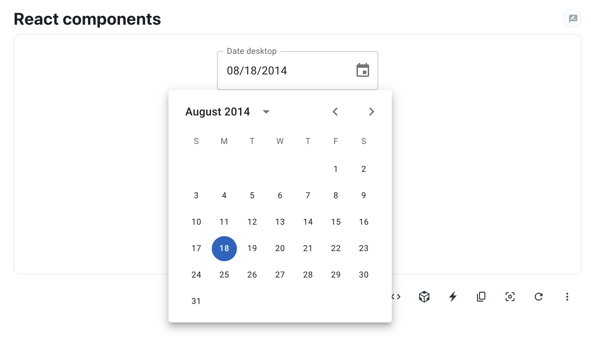</a>
</p>

<p align="center">
  <a href="https://mui.com/x/react-date-pickers/date-picker/" rel="noopener">
 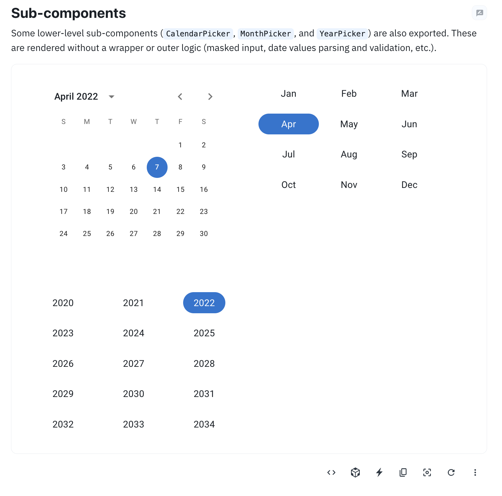</a>
 <a href="https://mui.com/x/react-date-pickers/date-range-picker/" rel="noopener">
 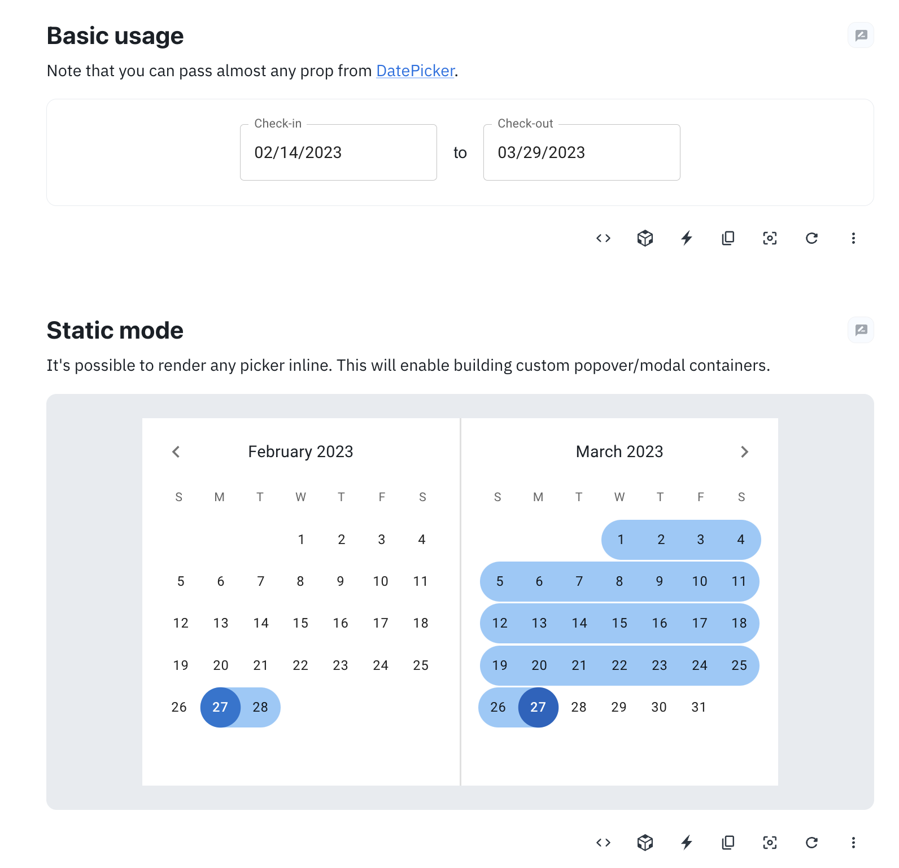</a>
</p>

<sup>Para acessae o documento clique aqui: [Material UI React Date Pickers](https://mui.com/x/react-date-pickers/getting-started/)</sup>

- **Material UI** é um Design System elaborado pela **Google** que resolve uma série de questões de usabilidade universalizando a experiência do usuário em determinadas aplicações.

O **Date Picker** que trazemos como proposta já implementamos em outros cenários, o que possibilita a agilidade no momento de adequar o Theme proposto, podendo ser feitas alterações sutís, como: cores, linguagem, arredondamento de bordas. A estrutura do componente não pode ser mudada pois podem trazer riscos à usabilidade.

<br/>

---

 <br/>

## ➡️ Compact Desktop - Progress Tracker <a name = "progressTracker"></a>[🔝](#init)

### Component HSBC.

 <br/>

```
Horas estimadas para a elaboração deste: 60 Horas / média de 7 dias para um mês de 22 dias úteis.
```

 <br/>

> [Wholesale Web Toolkit Version](<./refs/1.3%20Desktop%20HSBC%20Wholesale%20Web%20Toolkit%204.0.0%20(2)%20copy.pdf>): 4.0.0 December 2021. Página: 138

### Prints:

<p align="center">
  <a href="https://github.com/AmoreiraT/HSBC_Components_Issues/blob/main/refs/1.3%20Desktop%20HSBC%20Wholesale%20Web%20Toolkit%204.0.0%20(2)%20copy.pdf" rel="noopener">
 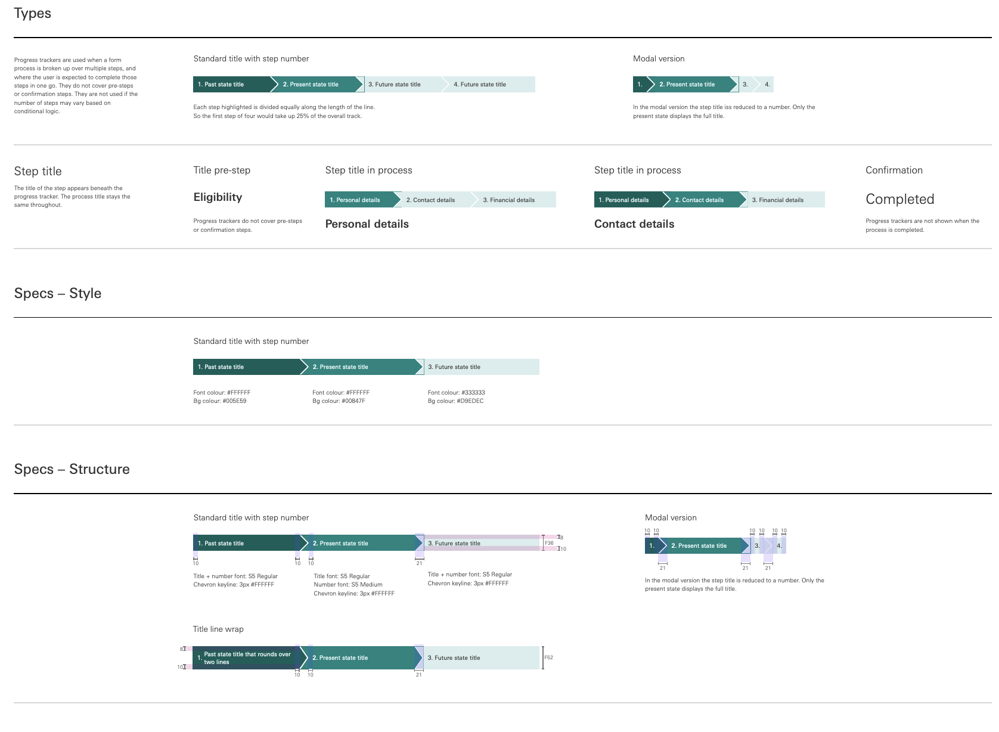</a>
</p>

<sup>Para acessae o documento clique aqui: [Wholesale Web Toolkit Version](<./refs/1.3%20Desktop%20HSBC%20Wholesale%20Web%20Toolkit%204.0.0%20(2)%20copy.pdf>)</sup>

**Compact Desktop - Progress Tracker** é um componente para mensurar e notar fases de um progresso, como em exemplos de formulários. O impacto deste componente está nos moldes pontiagudos que exigem um manuseio sensível do **Cascading Style Sheets** ( CSS ), para o desenho desta forma que pode encontrar problemas na responsividade à diversos tamanhos de telas ou redimensionamentos do browser.

<br/>

---

 <br/>

### Component Blue.

 <br/>

> [Material UI React Stepper](https://mui.com/material-ui/react-stepper/): Documentação completa.

### Prints:

<p align="center">
  <a href="https://mui.com/material-ui/react-stepper/#horizontal-stepper" rel="noopener">
 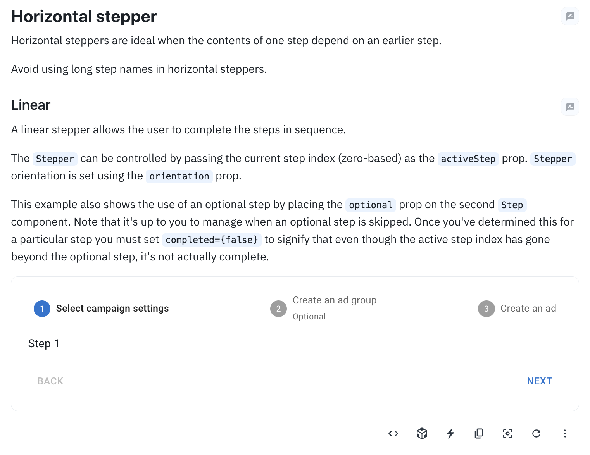</a>
</p>

<p align="center">
  <a href="https://mui.com/material-ui/react-stepper/#customized-horizontal-stepper" rel="noopener">
 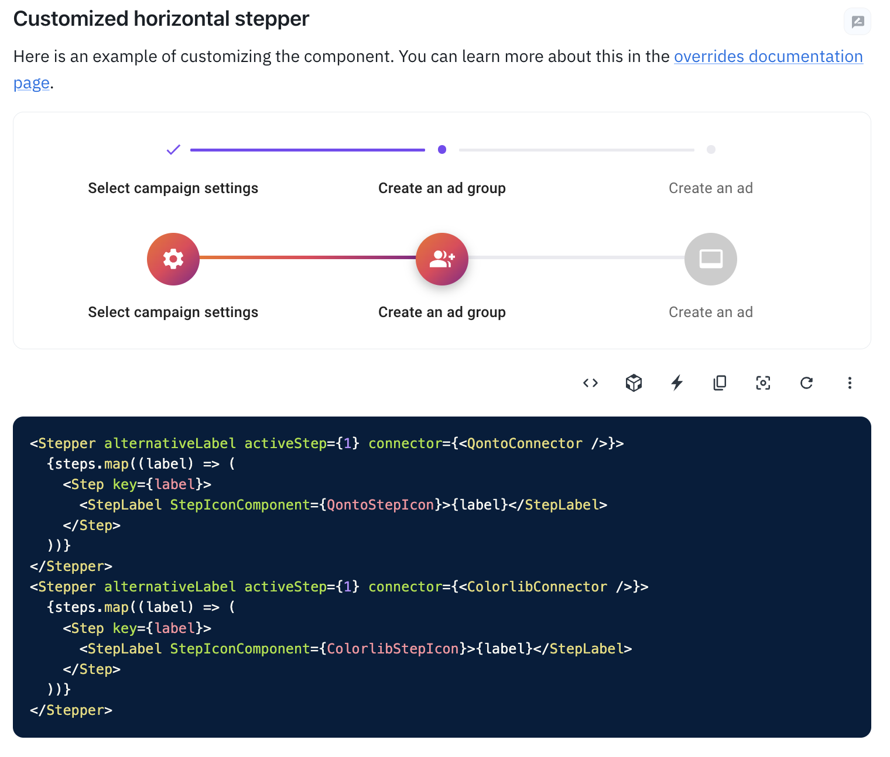</a>
</p>

<sup>Para acessae o documento clique aqui: [Material UI React Stepper](https://mui.com/material-ui/react-stepper/)</sup>

- **Material UI** é um Design System elaborado pela **Google** que resolve uma série de questões de usabilidade universalizando a experiência do usuário em determinadas aplicações.

O **Stepper** que trazemos como proposta já implementamos em outros cenários, o que possibilita a agilidade no momento de adequar o Theme proposto, podendo ser feitas alterações sutís, como: cores, linguagem, arredondamento de bordas. A estrutura do componente não pode ser mudada pois podem trazer riscos à usabilidade.

<br/>

---

 <br/>

## 📑 Table Data <a name = "tableData"></a>[🔝](#init)

### Component HSBC.

 <br/>

```
Horas estimadas para a elaboração deste: 180 Horas / média de 22 dias para um mês de 22 dias úteis.
```

 <br/>

> [Wholesale Web Toolkit Version](<./refs/1.3%20Desktop%20HSBC%20Wholesale%20Web%20Toolkit%204.0.0%20(2)%20copy.pdf>): 4.0.0 December 2021. Página: 157

### Prints:

<p align="center">
  <a href="https://github.com/AmoreiraT/HSBC_Components_Issues/blob/main/refs/1.3%20Desktop%20HSBC%20Wholesale%20Web%20Toolkit%204.0.0%20(2)%20copy.pdf" rel="noopener">
 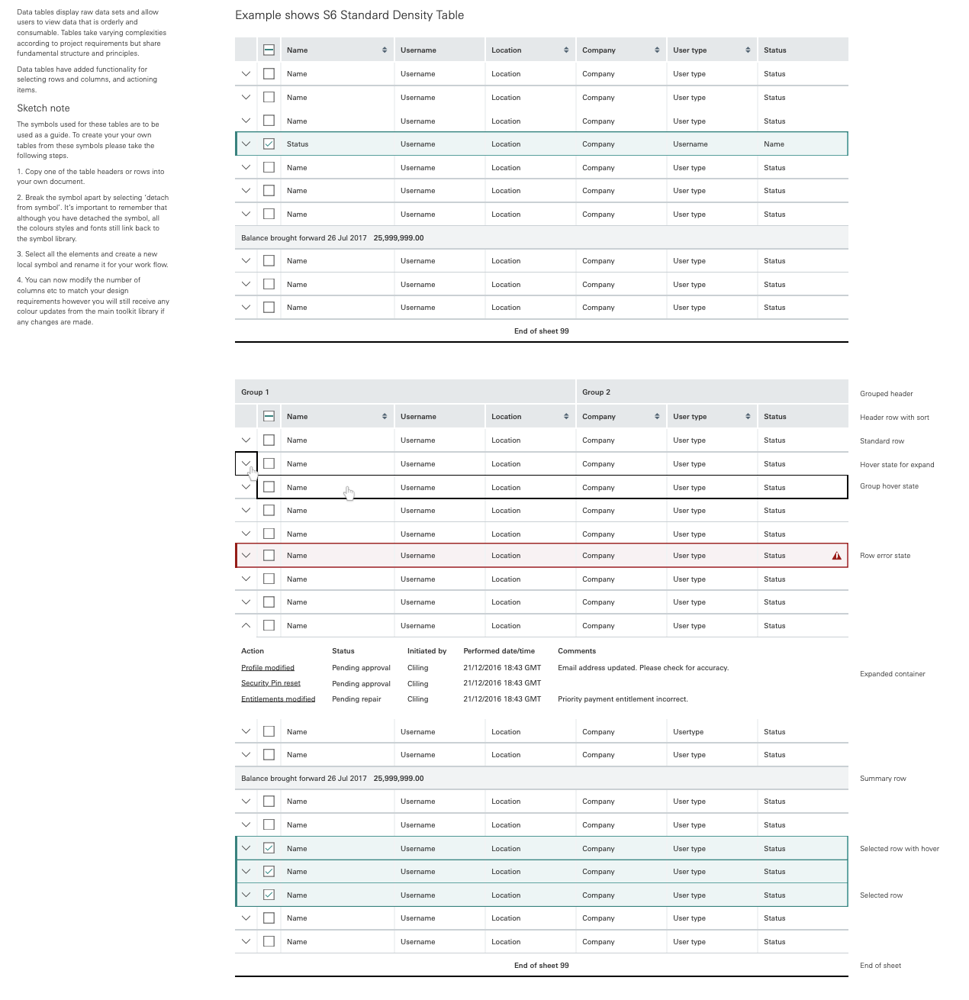</a>
</p>

<sup>Para acessae o documento clique aqui: [Wholesale Web Toolkit Version](<./refs/1.3%20Desktop%20HSBC%20Wholesale%20Web%20Toolkit%204.0.0%20(2)%20copy.pdf>)</sup>

**Table Data** é um componente de tabela de dados contendo linhas ordenadas por colunas que contém filtro de crescente e decrescente relativos aos dados daquela coluna. Além de um espaçado tempo para a confecção é preciso tratar diversos tipos de bugs como os de responsividade, de acordo a tamanhos de tela e redimensionamento do browser, e bugs que ocorrem com a leitura e consumo de dados gigantestos, causando problemas na desenvoltura do componente.

<br/>

---

 <br/>

### Component Blue.

 <br/>

> [Material UI React Data Grid](https://mui.com/x/react-data-grid/): Documentação completa.

### Prints:

<p align="center">
  <a href="https://mui.com/x/react-data-grid/" rel="noopener">
 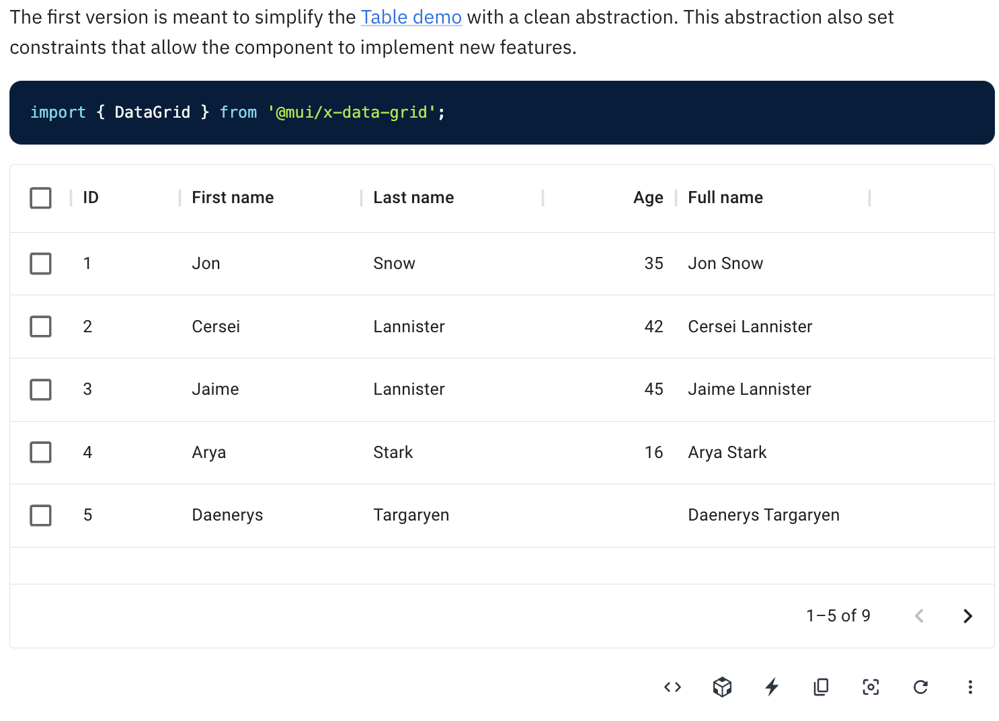</a>
</p>

<p align="center">
  <a href="https://mui.com/x/react-data-grid/editing/" rel="noopener">
 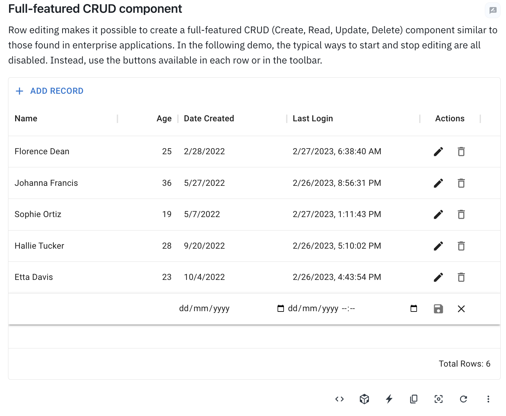</a>
 <a href="https://mui.com/x/react-data-grid/style/" rel="noopener">
 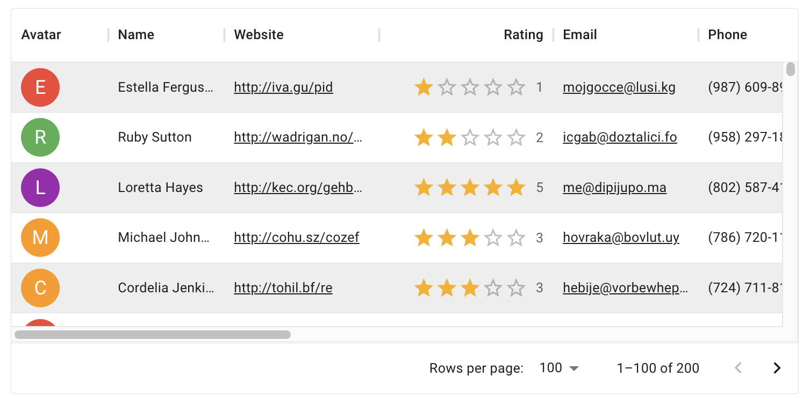</a>
</p>

<sup>Para acessae o documento clique aqui: [Material UI React Data Grid](https://mui.com/x/react-data-grid/)</sup>

- **Material UI** é um Design System elaborado pela **Google** que resolve uma série de questões de usabilidade universalizando a experiência do usuário em determinadas aplicações.

O **Data Grid** que trazemos como proposta já implementamos em outros cenários, o que possibilita a agilidade no momento de adequar o Theme proposto, podendo ser feitas alterações sutís, como: cores, linguagem, arredondamento de bordas. A estrutura do componente pode ser mudada e implementada ações de acordo com os exemplos acima retirados da documentação.

<br/>

---

 <br/>

## ➡️ Data grid - Pagination <a name = "paginator"></a>[🔝](#init)

### Component HSBC.

 <br/>

```
Horas estimadas para a elaboração deste: 80 Horas / média de 10 dias para um mês de 22 dias úteis.
```

 <br/>

> [Wholesale Web Toolkit Version](<./refs/1.3%20Desktop%20HSBC%20Wholesale%20Web%20Toolkit%204.0.0%20(2)%20copy.pdf>): 4.0.0 December 2021. Páginas: 124 > 125

### Prints:

<p align="center">
  <a href="https://github.com/AmoreiraT/HSBC_Components_Issues/blob/main/refs/1.3%20Desktop%20HSBC%20Wholesale%20Web%20Toolkit%204.0.0%20(2)%20copy.pdf" rel="noopener">
 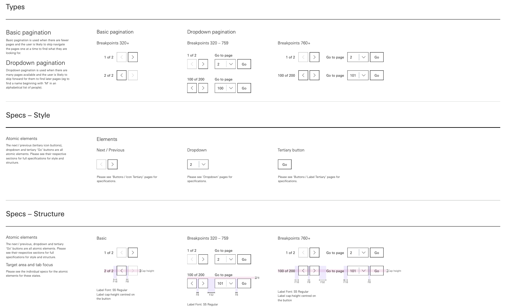</a>
</p>

<sup>Para acessae o documento clique aqui: [Wholesale Web Toolkit Version](<./refs/1.3%20Desktop%20HSBC%20Wholesale%20Web%20Toolkit%204.0.0%20(2)%20copy.pdf>)</sup>

**Data grid - Pagination** é um componente para melhor usabilidade e visualização numa série de muitos dados consumidos pela tabela, graças ao mesmo motivo também serve como respiro no momento do consumo de dados fornecendo melhor performance para o site. Para além de complicações para desenhar o componente em acordo com a performance desejada em reordenar a quatidade de dados por linhas à serem apresentados na tabela.

- O **Data grid - Paginationr** que trazemos como proposta é um componente já nativo da biblioteca [Material UI React Data Grid - Pagination](https://mui.com/x/react-data-grid/pagination/). O que o faz melhor reativo quando se utilizado no mesmo ecosistema de Design System. Outros exemplos de paginadores da Material UI podem ser encontrados aqui: [Material UI React Pagination](https://mui.com/material-ui/react-pagination/)

<br/>

---

 <br/>

### Component Blue.

 <br/>

> [Material UI React Data Grid - Pagination](https://mui.com/x/react-data-grid/pagination/): Documentação completa.

### Prints:

<p align="center">
  <a href="https://mui.com/x/react-date-pickers/getting-started/" rel="noopener">
 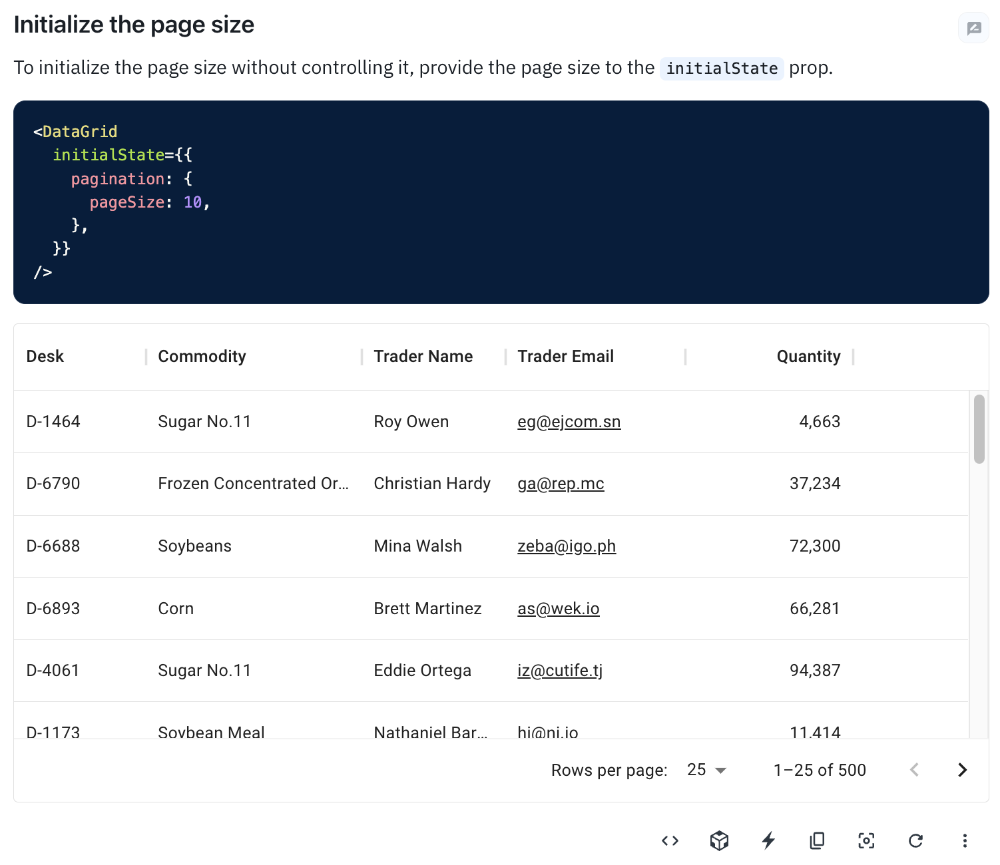</a>
</p>

<sup>Para acessae o documento clique aqui: [Material UI React Data Grid - Pagination](https://mui.com/x/react-data-grid/pagination/)</sup>

- **Material UI** é um Design System elaborado pela **Google** que resolve uma série de questões de usabilidade universalizando a experiência do usuário em determinadas aplicações.

O **Date Picker** que trazemos como proposta já implementamos em outros cenários, o que possibilita a agilidade no momento de adequar o Theme proposto, podendo ser feitas alterações sutís, como: cores, linguagem, arredondamento de bordas. A estrutura do componente não pode ser mudada pois podem trazer riscos à usabilidade.

<br/>

---

 <br/>

## 📟 Native Components <a name = "nativeComponents"></a>[🔝](#init)

 <br/>

> [Wholesale Web Toolkit Version](<./refs/1.3%20Desktop%20HSBC%20Wholesale%20Web%20Toolkit%204.0.0%20(2)%20copy.pdf>): 4.0.0 December 2021. Página: 79

### Prints:

<p align="center">
  <a href="https://github.com/AmoreiraT/HSBC_Components_Issues/blob/main/refs/1.3%20Desktop%20HSBC%20Wholesale%20Web%20Toolkit%204.0.0%20(2)%20copy.pdf" rel="noopener">
 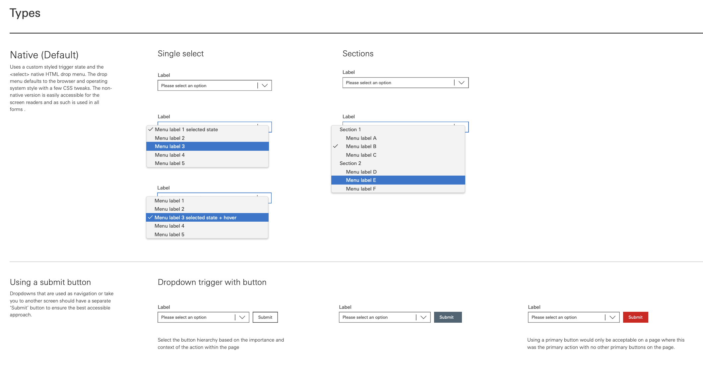</a>
</p>

<sup>Para acessae o documento clique aqui: [Wholesale Web Toolkit Version](<./refs/1.3%20Desktop%20HSBC%20Wholesale%20Web%20Toolkit%204.0.0%20(2)%20copy.pdf>)</sup>

**Componentes Nativos** do browser, SO ou dispositivo podem sofrer alterações de acordo com essas variações e versões por parte do cliente.

 <br/>

---

 <br/>

## 📍 Versionamentos <a name = "versionamentos"></a>[🔝](#init)

- [Material UI ](https://mui.com/material-ui/) - v5.11.10ˆ
- [MUI X Data Grid](https://mui.com/x/introduction/) - v5.17.25ˆ
- [MUI X Date Pickers](https://mui.com/x/react-date-pickers/getting-started/) - v5.0.20ˆ

 <br/>

---

 <br/>

## 🕸️ Acessos <a name = "links"></a>[🔝](#init)

 <br/>

> Protótipo do Portal Web em tempo real. <br/> **Link:** https://www.figma.com/proto/JHPXOOzrbejTLOK0593s7u/HSBC-Web?page-id=0%3A10&node-id=1359%3A9949&viewport=321%2C-255%2C0.14&scaling=contain&starting-point-node-id=1359%3A9949

 <br/>

> Design UI em tempo real. <br/> **Link:** https://www.figma.com/file/JHPXOOzrbejTLOK0593s7u/HSBC-Web?node-id=0%3A10&t=ishXP9WoRTXOQx8X-1

 <br/>

> Material UI. <br/> **Link:** https://mui.com/

 <br/>
 
> Wholesale Web Toolkit. <br/> **Link:** [Wholesale Web Toolkit Version PDF](<./refs/1.3%20Desktop%20HSBC%20Wholesale%20Web%20Toolkit%204.0.0%20(2)%20copy.pdf>)

 <br/>

---

 <br/>

## 🎉 Autores <a name = "autor"></a>[🔝](#init)

- [Thiago Moreira](https://github.com/AmoreiraT)
- [Lincoln Silva](https://github.com/lincolnsilva)
- [Estevão Vilas Boas](https://github.com/evilasboas)
