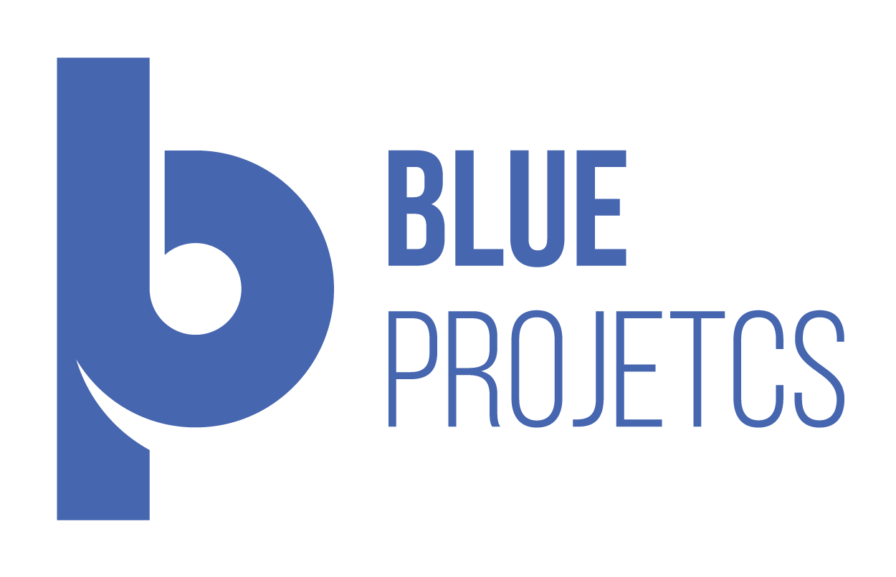

<p align="center">
  <a href="" rel="noopener">
 </a>
</p>

<h3 align="center">HSBC - Portal WEB.</h3>

<div align="center">

[]()
[](https://github.com/kylelobo/The-Documentation-Compendium/issues)

</div>

---

<p align="center"> 🤖 Componets e Design Systems, adequações e diferenças entre propostas praticaveis em tempo hábil em fronte à propostas de customização de Design System. Aqui serão notados apenas os components de maior custo para criação e impactos à usabilidade para a entrega em tempo hábil.
    <br> 
</p>

## 📝 Índice

- [Sobre](#sobre)
- [Figma](#figma)
- [Date Pickers](#datePicker)
- [Custom Progress Tracker](#progressTracker)
- [Table Data](#tableData)
- [Native Components](#nativeComponents)
- [Versionamentos](#versionamentos)
- [Links](#links)
- [Agradecimentos](#agradecimentos)

## 🧐 Sobre <a name = "sobre"></a>

Write sobre 1-2 paragraphs describing the purpose of your bot.

## 🎥 Figma <a name = "figma"></a>

```
Protótipo do Portal Web em tempo real.
```

**Link:** https://www.figma.com/proto/JHPXOOzrbejTLOK0593s7u/HSBC-Web?page-id=0%3A10&node-id=1359%3A9949&viewport=321%2C-255%2C0.14&scaling=contain&starting-point-node-id=1359%3A9949

<div align="center">
<iframe style="border: 1px solid rgba(0, 0, 0, 0.1);" width="800" height="450" src="https://www.figma.com/embed?embed_host=share&url=https%3A%2F%2Fwww.figma.com%2Fproto%2FJHPXOOzrbejTLOK0593s7u%2FHSBC-Web%3Fpage-id%3D0%253A10%26node-id%3D1359%253A9949%26viewport%3D321%252C-255%252C0.14%26scaling%3Dcontain%26starting-point-node-id%3D1359%253A9949" allowfullscreen></iframe>
</div>
 <br/>

```
Design UI em tempo real.
```

**Link:** https://www.figma.com/file/JHPXOOzrbejTLOK0593s7u/HSBC-Web?node-id=0%3A10&t=ishXP9WoRTXOQx8X-1

<div align="center">
<iframe style="border: 1px solid rgba(0, 0, 0, 0.1);" width="800" height="450" src="https://www.figma.com/embed?embed_host=share&url=https%3A%2F%2Fwww.figma.com%2Ffile%2FJHPXOOzrbejTLOK0593s7u%2FHSBC-Web%3Fnode-id%3D0%253A10%26t%3DishXP9WoRTXOQx8X-1" allowfullscreen></iframe>
</div>

## 💭 How it works <a name = "datePicker"></a>

The bot first extracts the word from the comment and then fetches word definitions, part of speech, example and source from the Oxford Dictionary API.

If the word does not exist in the Oxford Dictionary, the Oxford API then returns a 404 response upon which the bot then tries to fetch results form the Urban Dictionary API.

The bot uses the Pushshift API to fetch comments, PRAW module to reply to comments and Heroku as a server.

The entire bot is written in Python 3.6

## 🎈 progressTracker <a name = "progressTracker"></a>

To use the bot, type:

```
!dict word
```

The first part, i.e. "!dict" **is not** case sensitive.

The bot will then give you the Oxford Dictionary (or Urban Dictionary; if the word does not exist in the Oxford Dictionary) definition of the word as a comment reply.

### Example:

> !dict what is love

**Definition:**

Baby, dont hurt me~
Dont hurt me~ no more.

**Example:**

Dude1: Bruh, what is love?
Dude2: Baby, dont hurt me, dont hurt me- no more!
Dude1: dafuq?

---

<sup>Beep boop. I am a bot. If there are any issues, contact my [Master](https://www.reddit.com/message/compose/?to=PositivePlayer1&subject=/u/Wordbook_Bot)</sup>

<sup>Want to make a similar reddit bot? Check out: [GitHub](https://github.com/kylelobo/Reddit-Bot)</sup>

## 🏁 Getting Started <a name = "tableData"></a>

These instructions will get you a copy of the project up and running on your local machine for development and testing purposes. See [nativeComponents](#nativeComponents) for notes on how to deploy the project on a live system.

### Prerequisites

What things you need to install the software and how to install them.

```
Give examples
```

### Installing

A step by step series of examples that tell you how to get a development env running.

Say what the step will be

```
Give the example
```

And repeat

```
until finished
```

End with an example of getting some data out of the system or using it for a little demo.

## 🚀 Deploying your own bot <a name = "nativeComponents"></a>

To see an example project on how to deploy your bot, please see my own configuration:

- **Heroku**: https://github.com/kylelobo/Reddit-Bot#deploying_the_bot

## ⛏️ Built Using <a name = "versionamentos"></a>

- [PRAW](https://praw.readthedocs.io/en/latest/) - Python Reddit API Wrapper
- [Heroku](https://www.heroku.com/) - SaaS hosting platform

## ✍️ links <a name = "links"></a>

- [@kylelobo](https://github.com/kylelobo) - Idea & Initial work

See also the list of [contributors](https://github.com/kylelobo/The-Documentation-Compendium/contributors) who participated in this project.

## 🎉 agradecimentoss <a name = "agradecimentos"></a>

- Hat tip to anyone whose code was used
- Inspiration
- References
